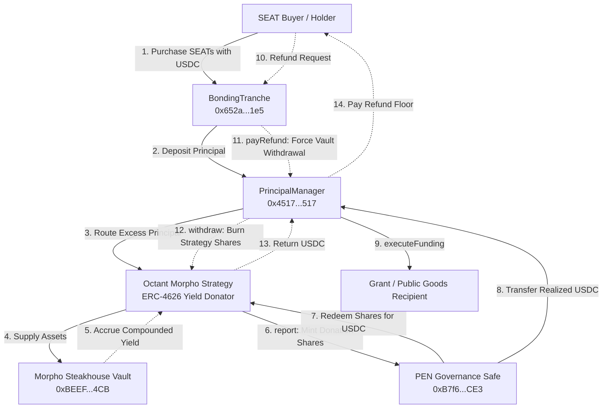

# PEN–Octant Integration Proof

[](https://github.com/intelliDean/penoctant/actions)


An open-source Foundry verification package demonstrating the production compatibility, yield-routing mechanics, and solvency invariants between **Shutter Network's Perpetual Endowment Network (PEN)** and **Octant's Yield-Donating Strategies** (specifically the Morpho Steakhouse USDC compounder) on a local Ethereum mainnet fork.

---

## Table of Contents

- [Overview & Motivation](#overview--motivation)
- [Architecture & Mechanics](#architecture--mechanics)
  - [System Topology](#system-topology)
  - [Lifecycle Sequences](#lifecycle-sequences)
- [Key Engineering Invariants Proven](#key-engineering-invariants-proven)
- [Empirical Balance Ledger & Results](#empirical-balance-ledger--results)
- [Pinned Mainnet Registry](#pinned-mainnet-registry)
- [Reproduction Guide](#reproduction-guide)
- [Repository Structure](#repository-structure)
- [License](#license)

---

## Overview & Motivation

### What is PEN?
Shutter's **Perpetual Endowment Network (PEN)** is an on-chain treasury mechanism designed to finance public goods and protocol development in perpetuity. Users buy **SEAT** governance tokens via a `BondingTranche`. The proceeds are held in a `PrincipalManager` that enforces a strict refund floor: SEAT holders retain the right to burn their tokens at any time to redeem their guaranteed refund price.

### What is Octant?
**Octant** builds regenerative finance infrastructure using ERC-4626 compounders. Unlike traditional vaults that inflate share prices (PPS) to reflect accrued interest, Octant's **Yield-Donating Strategies** hold share price constant at **1:1** and mint new profit-derived shares directly to a designated **`donationAddress`** (e.g., public goods treasuries).

### The Integration Challenge
To achieve sustainable funding, PEN needs to deploy its idle principal into yield-generating vaults without:
1. **Compromising Refund Solvency**: Can PEN always withdraw sufficient underlying assets to pay out SEAT refunds on demand, even when liquid cash is zero?
2. **Accounting Desynchronization**: Does Octant's donation-share minting conflict with PEN's `availableYield` accounting?
3. **Yield Dilution / Premature Distribution**: Does uncollected yield create "phantom" surplus in PEN before it is claimed?

This repository provides **cryptographic, reproducible proof** on an Ethereum mainnet fork that the candidate PEN–Octant integration functions without incompatibility.

---

## Architecture & Mechanics

### System Topology



### Lifecycle Sequences

1. **Capital Inflow (SEAT Purchase)**:
   - Buyer calls `BondingTranche.purchase(seats)`.
   - Bonding tranche transfers USDC to `PrincipalManager.recordPurchase()`.
   - `PrincipalManager` satisfies its `liquidReserveTarget` (e.g., 50 USDC) and deposits all excess cash into the Octant Morpho strategy via ERC-4626 `deposit()`.
   - PrincipalManager receives 1:1 strategy shares.

2. **Yield Harvest & Donation Routing**:
   - As Morpho Steakhouse earns interest, strategy assets grow.
   - An authorized keeper calls `strategy.report()`.
   - **Key Octant Dynamic**: Strategy PPS remains strictly **1:1** (`1,000,000`). All accrued profit is minted as **new strategy shares** directly to `PEN_SAFE` (`donationAddress`).
   - PrincipalManager's share balance remains unaltered.

3. **Yield Realization & Governance Distribution**:
   - Yield remains **quarantined** in the Safe's donation shares. `PrincipalManager.availableYield()` remains strictly **0**.
   - When governance is ready, `PEN_SAFE` calls `strategy.redeem()` to burn donation shares for USDC.
   - Safe transfers the redeemed USDC into `PrincipalManager`.
   - `PrincipalManager.availableYield()` (`totalManagedAssets - accountedPrincipal`) now reflects the donated yield.
   - Governance calls `PrincipalManager.executeFunding(recipients, amounts)` to distribute grant funding without reducing `accountedPrincipal`.

4. **Deep SEAT Refund (Vault Liquidity Withdrawal)**:
   - A holder calls `BondingTranche.refund(seats)`.
   - `BondingTranche` calls `PrincipalManager.payRefund()`.
   - If `liquidAssets() < refundAmount`, `_ensureLiquidity()` calls `vault.withdraw()` on the Octant strategy.
   - Octant strategy burns shares, pulls USDC from the underlying Morpho vault, and supplies exact liquid USDC to fulfill the refund.

---

## Key Engineering Invariants Proven

| # | Invariant | Description | Verification Test |
| :-: | :--- | :--- | :--- |
| **I** | **Price Per Share (PPS) Invariance** | Octant strategies never increase PPS. PPS remains strictly $1.000000$ throughout deposits, harvests, and withdrawals. | `01_DepositAndYieldRouting.t.sol` |
| **II** | **Yield Quarantine (No Phantom Yield)** | Minted donation shares are held exclusively by the Safe. `PrincipalManager.availableYield()` remains 0 until the Safe redeems and deposits USDC, preventing premature distribution. | `01_DepositAndYieldRouting.t.sol` |
| **III** | **Refund Solvency Under Zero Liquidity** | When PM has zero liquid cash, `payRefund()` triggers an automated ERC-4626 vault withdrawal, burning strategy shares and paying the refund without reverting. | `02_YieldRealizationAndRefund.t.sol` |
| **IV** | **Caller Authorization Enforcement** | Non-keepers attempting to invoke `strategy.report()` revert with `!keeper`. | `03_NegativeTests.t.sol` |
| **V** | **Diverted Yield Isolation** | If a strategy's `donationAddress` is configured to an external recipient, 100% of profit shares route away from PEN, and PEN accounting remains strictly uninflated. | `03_NegativeTests.t.sol` |
| **VI** | **Health Check Circuit Breakers** | Octant's `BaseHealthCheck` limits single-report profit to 100% APR (10,000 BPS), protecting against oracle and flash-loan anomalies. | `01_DepositAndYieldRouting.t.sol` |

---

## Empirical Balance Ledger & Results

The integration proof was executed against Ethereum mainnet state. Complete transaction traces are preserved in [`test_run.log`](./test_run.log) and detailed audits in [`RESULTS.md`](./RESULTS.md).

### Balance Progression (USDC Units, 6 Decimals)

$$\text{Available Yield} = \max(0, \text{Total Managed Assets} - \text{Accounted Principal})$$

| Lifecycle Event | Accounted Principal | Total Managed Assets | Liquid PM Cash | Strategy Shares (PM) | Donation Shares (Safe) | Available Yield |
| :--- | :---: | :---: | :---: | :---: | :---: | :---: |
| **1. Fork Initialization** | 101,000,000 | 101,000,000 | 101,000,000 | 0 | 0 | **0** |
| **2. Purchase 5 SEATs (@ 1 USDC)** | 106,000,000 | 106,000,000 | 50,000,000 | 56,000,000 | 0 | **0** |
| **3. Harvest +500 USDC Yield** | 106,000,000 | 106,000,000 | 50,000,000 | 56,000,000 | 499,999,999 | **0** *(Quarantined)* |
| **4. Safe Realizes Yield to PM** | 106,000,000 | 605,999,999 | 549,999,999 | 56,000,000 | 0 *(Redeemed)* | **499,999,999** |
| **5. Grant Payout (100 USDC)** | 106,000,000 | 505,999,999 | 449,999,999 | 56,000,000 | 0 | **399,999,999** |
| **6. Deep SEAT Refund (1 SEAT)** | 105,500,000 | 505,499,999 | 0 | 505,499,999 | 0 | **399,999,999** |

### Rounding & Trapped Asset Analysis
- **Observed Rounding**: Exactly **1 micro-USDC** ($0.000001) due to ERC-4626 integer division in `convertToAssets` (injected `500,000,000` $\to$ reported `499,999,999`).
- **Trapped Assets**: **0**. All shares and principal remain 100% redeemable on demand.
- **Dead Shares**: Live mainnet implementation at `0xb27064A2C51b8C5b39A5Bb911AD34DB039C3aB9c` mints 0 dead shares to `address(0xdead)`.

---

## Pinned Mainnet Registry

All fork tests execute against pinned Ethereum mainnet contracts:

| Contract / Entity | Network | Address | Description |
| :--- | :---: | :---: | :--- |
| **USDC** | Ethereum | [`0xA0b86991c6218b36c1d19D4a2e9Eb0cE3606eB48`](https://etherscan.io/address/0xA0b86991c6218b36c1d19D4a2e9Eb0cE3606eB48) | Underlying ERC-20 token (6 decimals) |
| **PEN PrincipalManager** | Ethereum | [`0x4517651c7071fecDA97Eb656a9d3A50B92b84517`](https://etherscan.io/address/0x4517651c7071fecDA97Eb656a9d3A50B92b84517) | Treasury accounting & vault router |
| **PEN BondingTranche** | Ethereum | [`0x652a9A770f9Cfe26e409Aa63E84B8a4e21abe1e5`](https://etherscan.io/address/0x652a9A770f9Cfe26e409Aa63E84B8a4e21abe1e5) | SEAT bonding curve purchase & refund |
| **PEN SeatToken** | Ethereum | [`0xe2F401A0fb40dA191b9fa8C44Fa09D31cE17374c`](https://etherscan.io/address/0xe2F401A0fb40dA191b9fa8C44Fa09D31cE17374c) | Non-transferable governance token |
| **PEN Safe (Multisig)** | Ethereum | [`0xB7f69C3cd9E3dFB4aE0Ed9ee65eb2Ed42EdeECE3`](https://etherscan.io/address/0xB7f69C3cd9E3dFB4aE0Ed9ee65eb2Ed42EdeECE3) | PEN Treasury owner & Strategy Management |
| **Octant Factory V1** | Ethereum | [`0x052d20B0e0b141988bD32772C735085e45F357c1`](https://etherscan.io/address/0x052d20B0e0b141988bD32772C735085e45F357c1) | Morpho compounder strategy deployer |
| **Octant TokenizedStrategy** | Ethereum | [`0xb27064A2C51b8C5b39A5Bb911AD34DB039C3aB9c`](https://etherscan.io/address/0xb27064A2C51b8C5b39A5Bb911AD34DB039C3aB9c) | Core strategy delegatecall logic |
| **Morpho Steakhouse Vault** | Ethereum | [`0xBEEF01735c132Ada46AA9aA4c54623cAA92A64CB`](https://etherscan.io/address/0xBEEF01735c132Ada46AA9aA4c54623cAA92A64CB) | Target yield-earning compounder vault |

---

## Reproduction Guide

### Prerequisites
- [Foundry](https://book.getfoundry.sh/) (`forge`, `cast`)
- Node / Internet access to reach an Ethereum mainnet RPC

### 1. Clone & Build
```bash
git clone https://github.com/intelliDean/penoctant.git
cd penoctant
forge build
```

### 2. Execute Test Suite
Run the full test suite against the mainnet fork:
```bash
forge test -vvv
```

Expected output:
```text
Ran 3 test suites: 4 tests passed, 0 failed, 0 skipped (4 total tests)
[PASS] test_DepositAndYieldRoutingFlow() (gas: 1821892)
[PASS] test_YieldRealizationAndDeepRefund() (gas: 4752685)
[PASS] test_Negative_UnauthorizedReportFails() (gas: 31527)
[PASS] test_Negative_DivertedYieldNotCountedAsAvailableToPEN() (gas: 3004573)
```

Run specific test modules:
```bash
# 1. Deposit & Yield Routing flow
forge test --match-test test_DepositAndYieldRoutingFlow -vvv

# 2. Yield Realization & Deep Refund flow
forge test --match-test test_YieldRealizationAndDeepRefund -vvv

# 3. Negative tests
forge test --match-contract NegativeTests -vvv
```

Using a custom RPC:
```bash
ETH_RPC_URL="https://your-rpc-endpoint" forge test -vvv
```

---

## Repository Structure

```text
penoctant/
├── .github/workflows/
│   └── test.yml                         # Automated CI workflow
├── dependencies/                        # Fully-tracked upstream packages
│   ├── @openzeppelin-contracts-5.3.0/
│   ├── @openzeppelin-contracts-upgradeable-5.3.0/
│   ├── @snapshot-x/
│   ├── forge-std-1.14.0/
│   ├── tokenized-strategy-3.0.4/
│   └── tokenized-strategy-periphery-3.0.2/
├── src/                                 # Contracts under test
│   ├── core/                            # Base strategy & tokenized strategy
│   ├── interfaces/                      # Factory & strategy interfaces
│   ├── strategies/                      # Morpho compounder & health check
│   ├── BondingTranche.sol               # PEN bonding curve logic
│   ├── PrincipalManager.sol             # PEN treasury management
│   ├── SeatToken.sol                    # PEN governance token
│   ├── constants.sol                    # Mainnet deployment addresses
│   └── errors.sol                       # Shared error definitions
├── test/                                # Executable integration proof
│   ├── 01_DepositAndYieldRouting.t.sol  # Deposit & yield routing flow
│   ├── 02_YieldRealizationAndRefund.t.sol # Yield realization & deep refund
│   ├── 03_NegativeTests.t.sol           # Access control & yield isolation
│   └── IntegrationBase.t.sol            # Base setup & fork wiring
├── foundry.toml                         # Foundry build & fork configuration
├── remappings.txt                       # Clean Solc 0.8.25 remappings
├── test_run.log                         # Verbatim captured test run output
├── RESULTS.md                           # Comprehensive audit & balance ledger
├── README.md                            # Project documentation & reproduction
└── LICENSE                              # Open-source MIT License
```

---

## License

This project is open-source software licensed under the [MIT License](./LICENSE).
